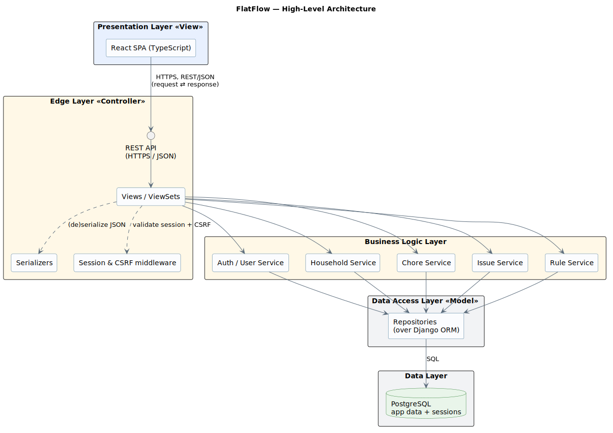

# FlatFlow

A shared space for roommates to coordinate chores, household issues, and house rules — without scattered group chats.

FlatFlow is a web app that gives people sharing an apartment or dorm a single place to manage chores, report household problems, and keep their house rules — making shared living more organized and less conflict-prone.

**Live demo:** [flatflow.space](https://flatflow.space)

## Overview

**Problem.** People sharing apartments or dormitories struggle with coordinating household responsibilities. Without a dedicated tool, chore assignments, maintenance issues and house rules end up scattered across group chats and verbal agreements, which leads to confusion and recurring conflict.

**Solution.** One shared household space where every member sees the same chores, issues and rules, with clear accountability for who is responsible and who actually did the work.

**Target users.** Mostly students and young adults living in shared apartments or dormitories.

## Features

- **Authentication & profile** — registration, login and logout via email/password; view and edit your display name.
- **Households** — create a household, invite roommates via a permanent invite code, view members, and leave (the last member to leave deletes the household and all its data).
- **Chore management** — create one-off **Tasks** (optional due date) and ongoing **Duties** (required start–end range), assign them to a roommate (or leave **Unassigned**), edit, delete or reopen, and mark them complete with a record of who did the work and when — all viewable as a shared list, filterable by assignee and status.
- **Chore calendar** — a month view showing Tasks on their due date and Duties as multi-day bars across their range, with month-to-month navigation.
- **Issue tracker** — report household problems, view them, switch status between open and resolved, and edit or delete your own.
- **House rules** — add, edit, delete and view a shared list of household agreements.

Scope is intentionally limited to the MVP. Out of scope: gamification, notifications, expense tracking, anonymous reporting, rule voting, a native mobile app, and password recovery.
See [docs/user-stories.md](docs/user-stories.md) for the full breakdown.

## Tech stack

| Layer | Technology |
| --- | --- |
| Frontend | React 19 + TypeScript (Vite, Tailwind CSS) |
| Backend | Django 6 + Django REST Framework |
| Database | PostgreSQL 16 |
| Auth | Session-based, HTTP-only cookies + CSRF |
| API tooling | drf-spectacular (OpenAPI) + orval (typed client) |
| Containerization | Docker & Docker Compose |
| Deployment | Hetzner Cloud VPS (GitHub Actions CI) |

See [docs/stack-rationale.md](docs/stack-rationale.md) for the reasoning behind each choice.

## Architecture

FlatFlow is a **decoupled client–server** application: a React SPA talks to a Django REST API over HTTP/JSON; PostgreSQL stores both application data and sessions. The backend is organized in layers — **Edge** (views/serializers, session + CSRF) -> **Business Logic** (per-domain services) -> **Data Access**
(repositories over the ORM) -> **Data** (PostgreSQL).



See: [docs/architecture/architecture.md](docs/architecture/architecture.md), data model: [docs/architecture/data-model.md](docs/architecture/data-model.md).

## Getting started (local)

The backend (Django REST API) lives in `src/backend` and the frontend (React SPA) in `src/frontend`. The quickest way to run everything — API, SPA and PostgreSQL together — is Docker Compose, so you don't need Python, Node or Postgres installed locally.

### Prerequisites

- [Docker](https://docs.docker.com/get-docker/) and Docker Compose v2
- Host ports `3000`, `8000` and `5432` free (frontend, API and PostgreSQL bind to them)

### 1. Configure environment

From the cloned repository root, copy the example env files (the defaults work for local development):

```bash
cp src/backend/.env.example src/backend/.env
cp src/frontend/.env.example src/frontend/.env
```

The backend `.env` also configures the PostgreSQL container — `POSTGRES_HOST=flatflow-db` is the Compose service name, so Django reaches the database with no extra setup.

### 2. Start the stack

```bash
cd src
docker compose --profile dev up -d --build
```

This builds and starts three containers: `flatflow-db` (PostgreSQL), `backend` (Django) and `frontend` (Vite dev server).

### 3. Apply database migrations

On first run, create the database schema:

```bash
docker compose exec backend python manage.py migrate
```

(Optional) create an admin user for the Django admin:

```bash
docker compose exec backend python manage.py createsuperuser
```

### 4. Open the app

| Service | URL |
| --- | --- |
| Frontend (SPA) | http://localhost:3000 |
| API root | http://localhost:8000/api/ |
| API docs (Swagger UI) | http://localhost:8000/api/docs/ |
| API docs (ReDoc) | http://localhost:8000/api/redoc/ |
| Health check | http://localhost:8000/health/ |
| Django admin | http://localhost:8000/admin/ |

To stop everything: `docker compose --profile dev down` (add `-v` to also drop the database volume).

## Deployment

Production runs on a **Hetzner Cloud VPS**. A GitHub Actions workflow ([`.github/workflows/deploy.yaml`](.github/workflows/deploy.yaml)) deploys on every push to `main`: it SSHes into the server, pulls the latest `main`, rebuilds the backend and database containers with Docker Compose, runs migrations and re-exports the production React build (served as static files, with `/api` reverse-proxied to the backend). It expects the `SERVER_HOST`, `SERVER_USER` and `SERVER_SSH_KEY` repository secrets.

## Documentation

- [User Stories](docs/user-stories.md) — epics and acceptance criteria
- [System Architecture](docs/architecture/architecture.md), [Data Model](docs/architecture/data-model.md)
- [Tech Stack Rationale](docs/stack-rationale.md)
- [Non-Functional Requirements](docs/nfr.md), [Project Risks](docs/risks.md)
- [API](docs/api/README.md)
- [Test Plan](docs/testing/test-plan.md), [Test Cases](docs/testing/test-cases.md)
- [Team Charter](TeamCharter.md) — roles, workflow, Definition of Done
