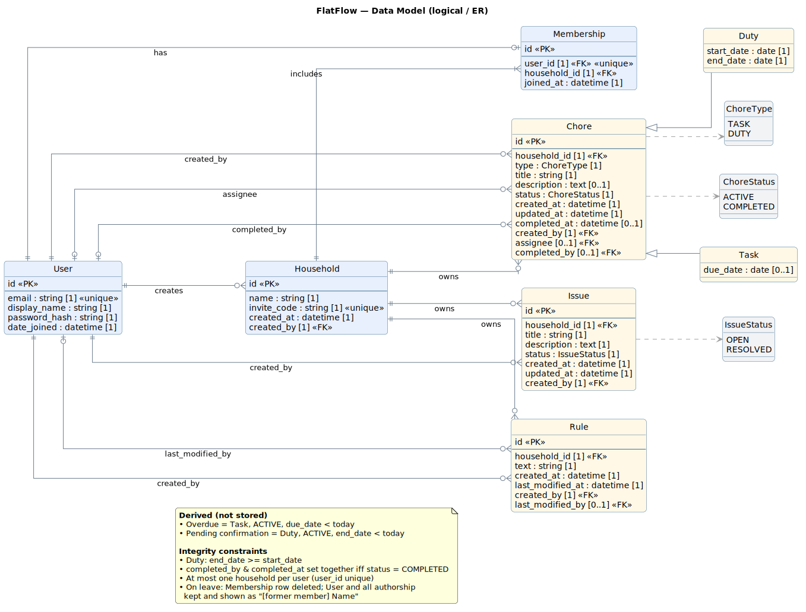

# Data Model

The domain model the backend Django apps implement. Authentication/session
tables (Django's built-in `User`, `Session`) are infrastructure and left out of
the diagram.



Source: [`uml/domain-model.puml`](./uml/domain-model.puml) → rendered to
`uml/domain-model.svg`. See [Regenerating the diagrams](#regenerating-the-diagrams).

## Entities

| Entity | Purpose | Key attributes |
| --- | --- | --- |
| **User** | A registered account | `email` (unique), `display_name`, `password_hash`, `date_joined` |
| **Household** | A shared living space | `name`, `invite_code` (unique, permanent), `created_at`, `created_by` |
| **Membership** | Links a user to their household | `joined_at`; **`user` is unique** → a user belongs to at most one household |
| **Chore** | Shared chore — supertype of **Task** / **Duty** | `type`, `title`, `description`, `status`, `created_at`, `updated_at`, `completed_at`, `created_by`, `assignee`, `completed_by` |
| ↳ **Task** | One-off chore | `due_date` (optional) |
| ↳ **Duty** | Period of responsibility | `start_date`, `end_date` (both required, `end ≥ start`) |
| **Issue** | A reported household problem | `title`, `description`, `status`, `created_at`, `created_by` |
| **Rule** | A recorded house agreement | `text`, `created_at`, `last_modified_at`, `created_by`, `last_modified_by` |

Enums: `ChoreType` (`TASK` / `DUTY`), `ChoreStatus` (`ACTIVE` / `COMPLETED`),
`IssueStatus` (`OPEN` / `RESOLVED`).

## Relationships

- A **Household** owns its **Memberships**, **Chores**, **Issues** and **Rules** (cascade delete). When the **last member leaves**, the household and all its data are deleted.
- A **User** has at most one **Membership**; a **Household** has many.
- A **User** is referenced from content in several roles: household `created_by`, chore `created_by` / `assignee` / `completed_by`, issue `created_by`, rule `created_by` / `last_modified_by`.

## Key design decisions

1. **Task and Duty share one table (single-table inheritance).** One `chore` table with a `type` discriminator; `due_date` is Task-only, `start_date` / `end_date` are Duty-only. This keeps the list, calendar and filters as single-table queries, and makes "type cannot change after creation" a simple invariant. A conditional `CHECK` enforces the per-type date columns at the DB level (`src/backend/chores/models.py`).

2. **Only `ACTIVE` and `COMPLETED` are stored.** They are the two states a member sets directly (mark done / reopen). The other user-facing states are **derived at read time** from status + dates + today, so they update automatically with no background job:

   - **Overdue** = Task, `ACTIVE`, `due_date < today`
   - **Pending confirmation** = Duty, `ACTIVE`, `end_date < today`

   The derivation lives in `ChoreService._effective_status` (`src/backend/chores/service.py`).

3. **Completion is tracked inline** (`completed_by` + `completed_at`), set together only when `status = COMPLETED`. The MVP needs the current "who did it", not a full completion history.

4. **Authorship survives a leave.** Leaving deletes the *Membership* row but keeps the *User*, so authorship foreign keys are retained and the name is shown as "[former member] Name". Only an **active** chore's `assignee` is reset to `NULL` (→ "Unassigned"); completed/past chores keep their assignee.

5. **`Membership` is a first-class entity**, not a nullable FK on `User`. It carries `joined_at`, makes join/leave a row create/delete, and lets the "former member" state be derived from the *absence* of a Membership row.

6. **Permissions live in the service layer, not the schema.** Any member may edit/delete chores and rules; only the author may edit/delete an issue, while any member may change an issue's status. The household creator gets no extra permissions — all members are equal.

## Regenerating the diagrams

```powershell
docker run --rm -v "${PWD}/docs/architecture/uml:/work" -w /work `
  plantuml/plantuml -tsvg "domain-model.puml"
```
